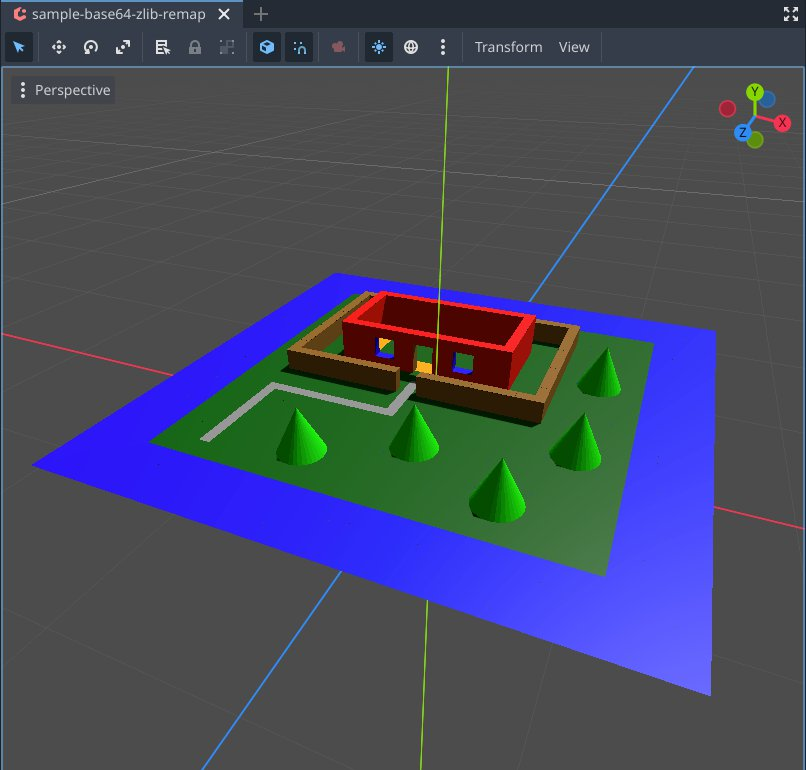
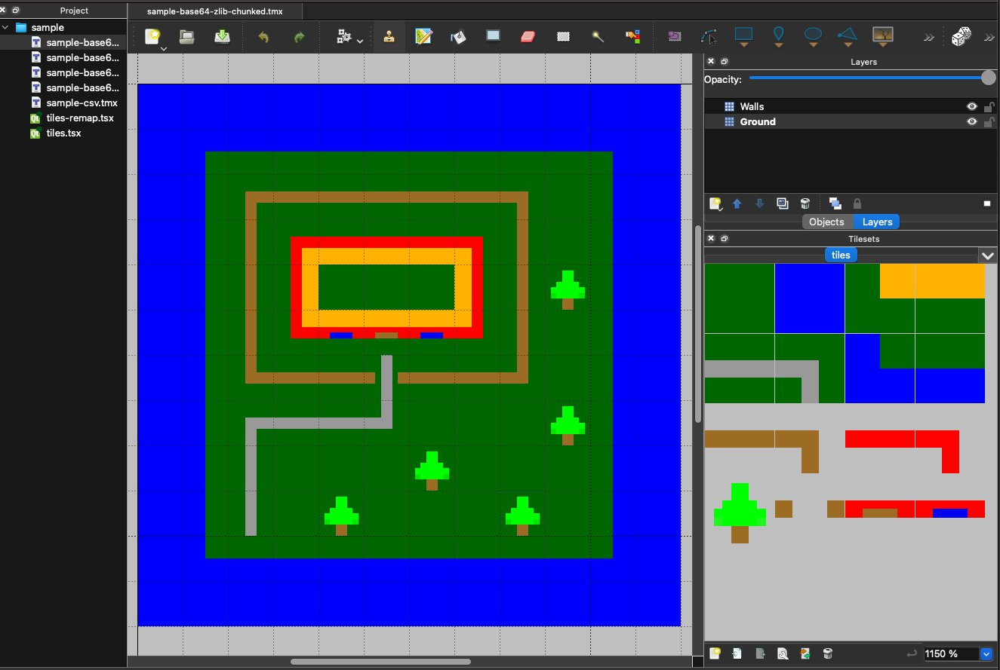
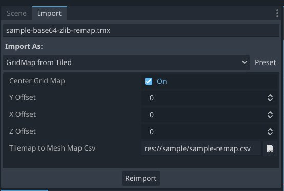

# Godot Tiled Map to GridMap Importer

This plugin was written using Godot 4.x

This is a plugin for [Godot Engine](https://godotengine.org) to import [Tiled Map Editor](http://www.mapeditor.org) TMX files as [GridMaps](https://docs.godotengine.org/en/stable/classes/class_gridmap.html)

The TMX XML parsing code and parsing of tile encoding was taken from [godot-tiled-importer](https://github.com/vnen/godot-tiled-importer/)

## Installation

Download or clone this repository and copy the contents of the
`addons` folder to your own project's `addons` folder.

## Features

The Importer will import exclusively Tile layers from the specified TMX map, and use them to generate a new `Y` level of the GridMap.
This allows you to build Tiled map files layer by layer and import them into a Godot GridMap.

The importer can parse most encodings of the TMX format: `csv`, `base64`, `base64 compressed`, and additionally will process the `infinite` TileMap chunks.
See `./samples/` for various encoding test cases. 

## Options:

* Center Grid Map : option will use an additional offset in the X and Z direction equal to half the width or height of the map. An 8x16 map will begin setting the GridMap starting at coordinate (-4,-8)

* X Offset, Y Offset, Z Offset: these values will allow starting TileMap import at a specific offset. Specifying a negative Y offset may allow importing the "Ground" below the GridMap 0,0,0 origin.

* Tilemap to Mesh - Map CSV: This option allows specifying an optional CSV map that will allow remapping the Tiled map ID to the Mesh Library ID. This is not needed if your Tiled TileSet corresponds exactly to the MeshLibrary's items (once sorted alphabetically). Should your Tiled tileset have excess items or for any reason not produce Tile ID's that exactly map, this CSV or TSV file can be used to specify the Tiled ID on the left column, and Mesh Library index (zero indexed) on the right column.
See: `sample-base64-zlib-remap` and associated `sample-remap.csv` in the `./sample/` folder. This sample uses a 5x4 tileset, but maps the corrisponding TileSet IDs to a 4x4 16-item Mesh Library. 